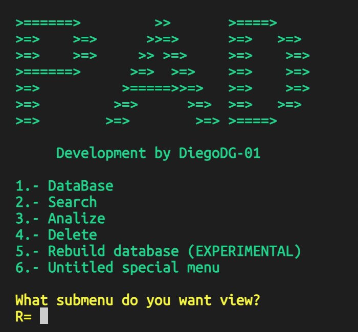
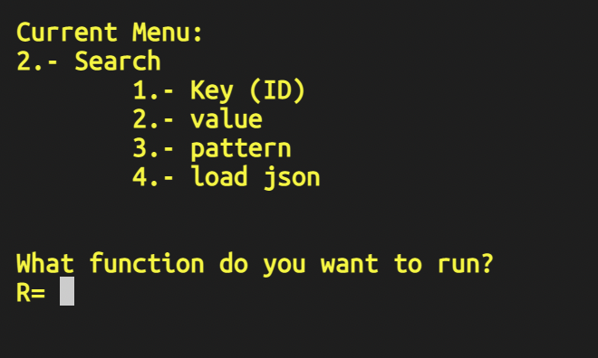

<p align="center">
  <a href="" rel="noopener">
 </a>
</p>

<h1 align="center">SQL POISON RESEARCH</h1>

<div align="center">

[]()
[]()
[]()
[]()
[]()

</div>

---

<p align="center"> 
  Análisis, obtención y visualización de información almacenada en bases de datos SQL.
</p>

## 📝 Tabla de contenido

- [Acerca de](#about)
- [Comenzar](#getting_started)
- [Pruebas](#tests)
- [Notas](#notes)
- [Desarrolladoa con](#built_using)
- [Autor](#authors)
- [Agradecimientos](#acknowledgement)

## 🧐 Acerca de <a name = "about"></a>

Mediante esta herramienta se pretende agilizar el análisis y obtención de información de bases de datos SQL a través de archivos previamente configurados,
logrando así ahorrar tiempo, además de mostrar resultados de manera visual o generando reportes con dicha información.


## 🏁 Comenzar <a name = "getting_started"></a>

Estas instrucciones le proporcionarán una copia del proyecto en funcionamiento en su máquina local esto con fines de desarrollo y prueba. Consulte el apartado de [Comenzar](#getting_started) para obtener notas sobre cómo iniciar el proyecto.

El script actualmente este siendo desarrollado y probado en SGBD como MySQL & MariaDB.

### Pre-requisitos

Es necesario contar con un SGBD como:

```
MySQL

O

MariaDB
```

Además, es necesario contar con Python instalado en nuestro computador.

```
Python 3.8 o superior
```

### Instalación

Para su instalación y debido a el estado en que se encuentra actualmente no se requieren configuraciones complejas, ya que solo basta con descarga el proyecto.

- Descargamos el proyecto.

```
git clone https://github.com/DiegoDG-01/SQL-POISON-RESEARCH
```

- Colocamos la carpeta descargada en la ruta que mejor nos parezca.
- Con algún editor abriremos primeramente el archivo "Configuration_Script.json" el cual se encuentra en la ruta "/SRC/Data/"
- Nos dirigimos al apartado de "actually" y colocaremos la información de acuerdo con nuestras configuraciones.
  - Host.
  - Usuario.
  - Contraseña.
  - Nombre de la base de datos. (Esta será la base de datos sobre la cual trabajará el script)
  - Stauts (Mantener el valor por default).

```
"actually":
  {
    "Host":"localhost", 
    "User":"TEST", 
    "Pass":"TEST", 
    "DB":"TEST", 
    "Charset":"utf8mb4",
    "Status":1
  }
```

- Por último, configuraremos el archivo "Data_Structure.json" el cual nos permitirá ejecutar consultar de manera automatizada, se encuentra en la ruta "/SRC/Data/"
(Actualmente es requerido ya que es la función que muestra el funcionamiento del script).

  - Estructura:
    - El primer nivel corresponde a la acción a realizar sobre la base de datos consultar, insertar, actualizar o eliminar. (Deberá seguir un estándar en los nombres como "search", "delete", "update" o "insert")
      ```
      {
        "search":
        {
            
        }
      }
      ```

    - El segundo nivel se especificará la tabla ("tables" es la palabra clave) sobre la cual realizaremos las acciones, así como los datos que buscaremos.
      ```
      {
        "search":
        {
            "tables":
            [
                "usuarios"
            ]
        }
      }
      ```

    - Data: en este caso es necesario especificar que tipo de búsqueda se realizara, por claves(key), valores(value) o patrones(patterns) (Este ultimo aun no esta implementado).
      ```
      {
        "search":
        {
            "tables":
            [
                "usuarios"
            ],

            "data":
            {
                "key":
                {

                },

                "value":
                {
                                    
                },

                "ShowData":"Name, Age",
            }
        }
      }
      ```

    - Una vez especificado que tipo de búsqueda realizara tenemos que detallar que valores buscaremos y opcionalmente que información de columnas queremos obtener. (Si no se especifica columnas con "ShowData" retornara todas las disponibles)

      ```
      {
        "search":
        {
            "tables":
            [
                "usuarios"
            ],

            "data":
            {
                "key":
                {
                  "column":"ID",
                  "value":[1,2,3,4]
                },
                
                "value":
                {
                                    
                },

                "ShowData":"Name, Age",
            }
        }
      }
      ```

Esa es la estructura interna necesaria para hacer funcionar el script de manera automatizada, el archivo puede ser modificado para variar el tipo de consultas y datos a obtener, pero siempre manteniendo dicha estructura.


## 🔧 Pruebas <a name = "tests"></a>

Con el fin de facilitar el entendimiento del proyecto en la ruta "/Other/SQL/" encontraras un base de datos de pruebas con la cual podrás ejecutar el script sin ningún problema, basta con importarla en tu SGBD.

- Dirígete a la ruta "SRC" del proyecto y ejecuta el comando:

  ```
  python3 main.py
  ```

- Seleccionamos la opción #2.

  

  **Nota:** Actualmente solo la función #2 (search) esta operativa.

- Elegimos la opción 4. (Cargara y ejecutara el archivo "Data_Structure.json")

  

- Finalmente mostrara el resultado que obtuvo en la consulta de los datos y finalizara el script.

  

## 🗒 Notas <a name="notes"></a>

Actualmente esta en desarrollo la fase alpha del proyecto, por lo cual su funcionalidad es limitada y existe un gran porcentaje de fallo,
con lo cual se recomienda trabajar con cuidado y no hacer uso de bases de datos con información importante para usted.


## ⛏️ Construido con <a name = "built_using"></a>

- [Python](https://www.python.org) - Lenguaje de programación

## 👾 Caracteristicas futuras <a name = "built_using"></a>

- Análisis automático de la estructura interna de la Base de datos.
- Uso de inteligencia artificial que agilice en mayor medida el análisis y tratamiento de la información.


## ✍️ Autor <a name = "authors"></a>

- [@DiegoDG-01](https://github.com/DiegoDG-01) - Idea & trabajo inicial


## 🎉 Agradecimientos <a name = "acknowledgement"></a>

- Logo by Good Ware (FlatIcon)
